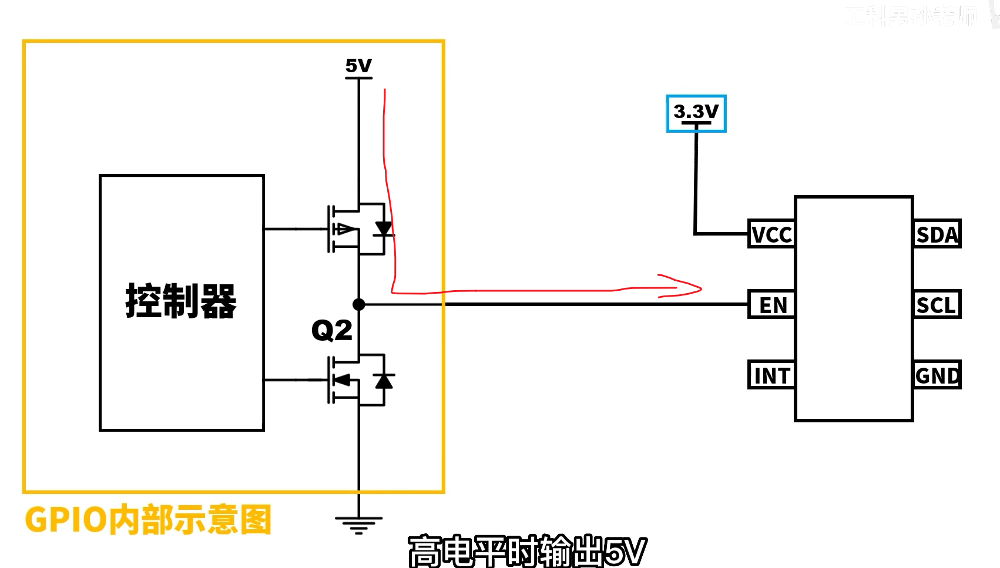
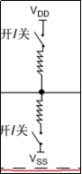
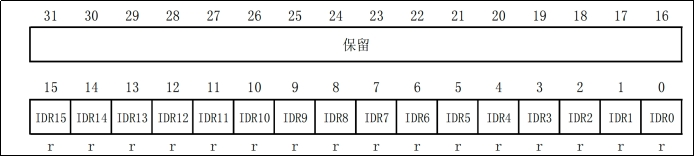
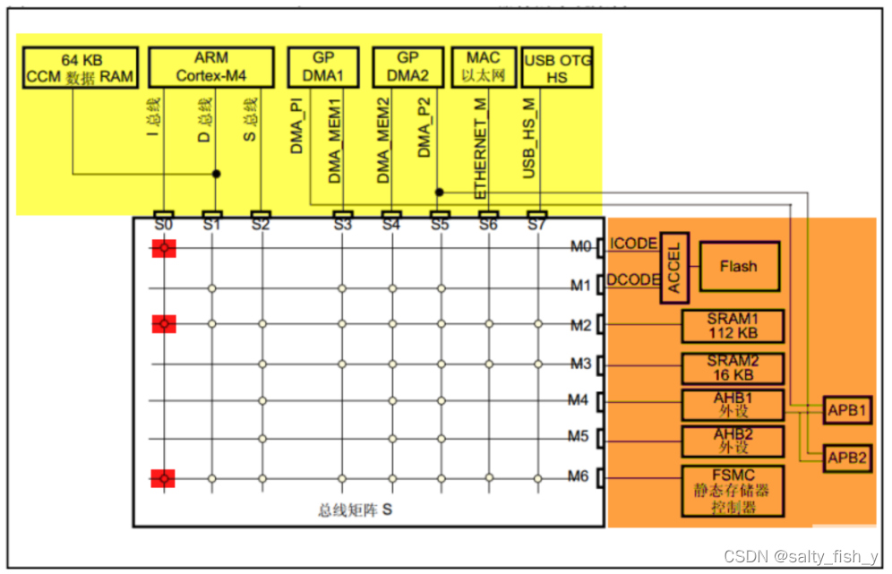

# STM32学习笔记

## 1.GPIO外设相关,2025/4/3

### 1.1用寄存器方式点亮LED灯

步骤:(以GPIOF--->Pin9为例)

```c
    //下面来尝试点亮  LED0 -- PF9 所控制
    //1.时钟配置,RCC寄存器对应的GPIOF时钟使能
    RCC->AHB1ENR |= 1<<5;
    // 2. 配置 Pin9 为输出模式
    GPIOF->MODER &= ~(3 << 18);     // 清除模式,2*9=18
    GPIOF->MODER |= 1 << 18;        // 通用输出模式（01）
    // 3. 配置输出速度为高速
    GPIOF->OSPEEDR &= ~(3 << 18);	//2*9=18
    GPIOF->OSPEEDR |= 2 << 18;      // 高速（10）
    // 4. 启用上拉电阻
    GPIOF->PUPDR &= ~(3 << 18);
    GPIOF->PUPDR |= 1 << 18;        // 上拉（01）
    // 5. 配置为推挽输出
    GPIOF->OTYPER &= ~(1 << 9);     // 清除类型（默认为推挽）
	while(1)//实现的是让LED闪烁的效果
	{
    // 6. 点亮 LED（假设低电平点亮）       
	GPIOF->BSRR = 1 << (9 + 16);     // BSRR高16位：Pin9置低 
    delay_ms(500);
    // 7. 熄灭 LED
    GPIOF->BSRR = 1 << 9;            // BSRR低16位：Pin9置高
    delay_ms(500);
//    GPIOF->ODR |= 1<<9; //熄灭
//    GPIOF->ODR &= ~(1<<9);//点亮,将控制语句换为这两句也是可以的,但是更加推荐上面的方式(原因如下)
	}
```

注意:

1. 在嵌入式开发中，**原子操作**（Atomic Operation）指的是一个不可被中断的完整操作——要么全部执行成功，要么完全不执行，中间不会被其他代码（如中断、多线程）打断。而 **"无需读-改-写"** 指的是不需要先读取寄存器当前值、修改特定位、再写回寄存器的传统流程，而是**直接通过寄存器设计实现单步原子操作**。

2. ##### 为什么需要原子操作？

   当多个代码（如主循环和中断）同时操作同一个寄存器时，传统的 **读-改-写**（Read-Modify-Write）流程可能引发 **竞态条件**（Race Condition）。例如：

   ```c
   // 假设在中断中操作GPIO的某个位：
   void Interrupt_Handler() {
       GPIOA->ODR |= 1 << 5; // 读-改-写：读取ODR，设置Bit5，再写回
   }
   // 主循环中同时操作另一个位：
   void main() {
       GPIOA->ODR |= 1 << 6; // 读-改-写
   }
   ```

   如果中断在主循环的 **读** 和 **写** 之间触发，主循环的修改会被中断的写入覆盖，导致数据不一致。

   3.STM32的解决方案：BSRR寄存器，STM32的GPIO模块提供了一个专用寄存器 **BSRR**（Bit Set/Reset Register），它的设计允许直接通过单次写操作设置或清除某个GPIO位，无需读-改-写，天然支持原子操作。

关键总结：

| 特性         | 读-改-写（ODR）      | BSRR原子操作         |
| :----------- | :------------------- | :------------------- |
| **操作步骤** | 读→改→写（3步）      | 直接写（1步）        |
| **竞态风险** | 高（可能被中断打断） | 无（单步原子操作）   |
| **代码效率** | 低（需要多次操作）   | 高（单指令完成）     |
| **适用场景** | 需要同时修改多个位   | 单一位或独立位的操作 |

### 1.2补充F407系列芯片手册与stm32f407xx.h头文件的关系


1.上两张图可以看出是一一对应的关系，即头文件中定义了一个结构体RCC_TypeDef，里边的成员变量是按照内存器表排序的


2.RCC是一个大的单元，他被宏定义成了一个（RCC_TypeDef*）RCC_BASE 的地址，一步步深挖，可以发现地址相加在一起，刚好是外设基地址+AHB1外设基地址+RCC的基地址，定位到RCC这个打的模块上


### 1.3尝试解读一下正点原子所给的一些封装好的代码

这是封装好的函数，我们看看他都干了些啥？


1. 使能时钟
2. GPIO复用功能设置

该函数逻辑

1. **循环遍历所有引脚（0到15）**

   ```c
   for (pinpos = 0; pinpos < 16; pinpos++)
   ```

   - GPIO端口通常有16个引脚（从0到15），通过循环逐个检查每个引脚是否需要配置。

2. **检查当前引脚是否需要配置**

   ```c
   pos = 1 << pinpos;      /* 生成当前引脚的掩码 */
   curpin = pinx & pos;    /* 检查引脚是否在pinx中 */
   if (curpin == pos)      /* 如果需要配置 */
   ```

   - `pos`是一个掩码，用于检查`pinx`中是否包含当前引脚（例如，`pinx`为`0x0001`表示第0引脚，`0x0002`表示第1引脚）。
   - 如果`curpin`等于`pos`，说明当前引脚需要配置。

3. **配置GPIO模式**

   ```c
   p_gpiox->MODER &= ~(3 << (pinpos * 2)); /* 清除原来的设置 */
   p_gpiox->MODER |= mode << (pinpos * 2); /* 设置新的模式 */
   ```

   - 每个GPIO引脚的模式由2位表示（`MODER`寄存器的每2位对应一个引脚）。
   - `~(3 << (pinpos * 2))`：生成一个掩码，将对应引脚的2位清零。
   - `mode << (pinpos * 2)`：将新的模式值左移到对应位置，并写入`MODER`寄存器。

4. **配置输出速度和输出类型（如果模式是输出或复用功能模式）**

   ```c
   if ((mode == 0X01) || (mode == 0X02))   /* 如果是输出模式或复用功能模式 */
   {
       p_gpiox->OSPEEDR &= ~(3 << (pinpos * 2));       /* 清除原来的设置 */
       p_gpiox->OSPEEDR |= (ospeed << (pinpos * 2));   /* 设置新的速度值 */
       p_gpiox->OTYPER &= ~(1 << pinpos);             /* 清除原来的设置 */
       p_gpiox->OTYPER |= otype << pinpos;             /* 设置新的输出模式 */
   }
   ```

   - **`OSPEEDR`寄存器**：用于设置GPIO引脚的输出速度。
   - **`OTYPER`寄存器**：用于设置GPIO引脚的输出类型（推挽或开漏）。
   - 只有当引脚模式为输出模式（`0x01`）或复用功能模式（`0x02`）时，才需要配置输出速度和输出类型。

5. **配置上下拉电阻**

   ```c
   p_gpiox->PUPDR &= ~(3 << (pinpos * 2)); /* 先清除原来的设置 */
   p_gpiox->PUPDR |= pupd << (pinpos * 2); /* 设置新的上下拉 */
   ```

   - **`PUPDR`寄存器**：用于配置GPIO引脚的上下拉电阻。
   - 每个引脚的上下拉电阻由2位表示，通过类似的操作清除旧值并设置新值。

总结一下，这个函数就是把这块开发板对应的端口做了封装，对于GPIOx(A,B...)进行了封装,使得通过上边的一个函数对所有的GPIO进行初始化配置,其代码本质上还是在控制各类寄存器(将1.1的部分又封装了一层,并且使其具有通用性)

3.GPIO引脚输出电平的控制


**可以清除的发现也是通过控制BSRR来控制引脚的高低电平的**

### 1.4GPIO基本结构分析


**① 保护二极管**:

保护二极管共有两个，**用于保护引脚外部过高或过低的电压输入。当引脚输入电压高于VDD 时**（意味着这个保护电路往往是在输入模式的情况下才会生效），上面的二极管导通，当引脚输入电压低于 VSS 时，下面的二极管导通，从而使输入芯片内部的电压处于比较稳定的值。虽然有二极管的保护，但这样的保护却很有限，大电压大电流的接入很容易烧坏芯片。所以在实际的设计中我们要考虑设计引脚的保护电路。

**② 上拉、下拉电阻**

它们阻值大概在 30~50K 欧之间，可以通过上、下两个对应的开关控制，这两个开关由寄存器控制。当引脚外部的器件没有干扰引脚的电压时，即没有外部的上、下拉电压，引脚的电平由引脚内部上、下拉决定，开启内部上拉电阻工作，引脚电平为高，开启内部下拉电阻工作，则引脚电平为低。同样，如果内部上、下拉电阻都不开启，这种情况就是我们所说的浮空模式。浮空模式下，引脚的电平是不可确定的。引脚的电平可以由外部的上、下拉电平决定。

注意:感谢铁头山羊的GPIO讲解，让我知道了，当io输入断开时，单片机内部犹如一个无限大阻值的电阻，io引脚就像个条线，会接受电磁信号，这对32的输入是干扰源的存在因此需要适时的开启上拉下拉电阻，保证引脚处于一个高或者低对的电平，杜绝电磁信号的干扰，并且当单片机复位之后所有gpio都会被设置为符空状态，达到高阻抗状态(起到安全，节能的作用)

**③施密特触发器**,存在于输入部分


**④** **P-MOS** **管和** **N-MOS** **管**

这个结构控制 GPIO 的开漏输出和推挽输出两种模式。开漏输出：输出端相当于三极管的集电极，要得到高电平状态需要上拉电阻才行。推挽输出：这两只对称的 MOS 管每次只有一只导通，所以导通损耗小、效率高。输出既可以向负载灌电流，也可以从负载拉电流。推拉式输出既能提高电路的负载能力，又能提高开关速度。

#### 1.4.1推挽输出


通过	控制置位/复位寄存器间接控制输出数据寄存器	或	直接控制输出数据寄存器来控制P-Mos和N-Mos的通断进而实现

"推电流,挽电流"的操作,直接将引脚置为高低电平，此时要注意输入数据部分是被打开的，意思是，我们可以读取当前IO口的状态。

**特性**

- **驱动能力强**：能直接输出高/低电平，无需外部上拉电阻。
- **高低电平切换速度快**：适合高速信号（如SPI、PWM）。
- **无外部元件依赖**：独立驱动负载（如LED、继电器）。

**典型应用**

- 需要强驱动能力的场景：LED控制、数字信号传输（SPI、USART）。
- 单设备独占总线的情况

#### 1.4.2开漏输出


**开漏模式下，P-MOS 管是一直截止的，**所以 P-MOS 管的栅极一直接 VSS。

如果输出数据寄存器设置为 0 时，经过“输出控制”的逻辑非操作后，输出逻辑 1 到 N-MOS 管的栅极，这时 N-MOS 管就会导通，使得 I/O 引脚接到 VSS，即输出低电平。

如果输出数据寄存器设置为 1 时，经过“输出控制器”的逻辑非操作后，输出逻辑 0 到 N-MOS 管的栅极，这时 N-MOS 管就会截止。

**因为 P-MOS 管是一直截止的，使得 I/O 引脚呈现高阻态，即不输出低电平，也不输出高电平。**因此要 I/O 引脚输出高电平就必须接上拉电阻。这时可以接内部上拉电阻，或者接一个外部上拉电阻。由于内部上拉电阻的阻值较大，所以只是“弱上拉”。需要大电流驱动，请接外部的上拉电阻。此外，**上拉电阻具有线与特性，即如果有很多开漏模式的引脚连在一起的时候，只有当所有引脚都输出高阻态，电平才为 1，只要有其中一个为低电平时，就等于接地，使得整条线路都为低电平 0。我们的 IIC 通信（IIC_SDA）就用到这个原理。**另外在开漏输出模式下，施密特触发器是打开的，所以 IO 口引脚的电平状态会被采集到输入数据寄存器中，如果对输入数据寄存器进行读访问可以得到 IO 口的状态。**也就是说开漏输出模式下，我们可以对 IO 口进行读数据。**

**特性**

- **电平灵活性**：通过外部上拉电阻可适配不同电压（如3.3V或5V系统）。
- **总线共享**：支持“线与”逻辑，多个设备可共享同一总线（如I2C）。
- **驱动能力弱**：高电平依赖外部上拉电阻，上升沿可能较慢。

**典型应用**

- 多设备总线通信：I2C、SMBUS（避免总线冲突）。
- 电平转换：连接不同电压的器件。
- 需要“线与”逻辑的场景（如多中断信号共享）。

**两种输出方式的关键对比**

| **特性**         | **推挽输出**         | **开漏输出**              |
| :--------------- | :------------------- | :------------------------ |
| **电路结构**     | P-MOS + N-MOS        | 仅N-MOS，P-MOS关闭        |
| **高电平驱动**   | 直接由VDD提供        | 依赖外部上拉电阻          |
| **低电平驱动**   | 直接由GND提供        | 直接由GND提供             |
| **电平切换速度** | 快（双MOS驱动）      | 慢（依赖上拉电阻）        |
| **总线冲突风险** | 高（可能短路）       | 低（支持线与逻辑）        |
| **典型应用**     | LED、SPI、单设备通信 | I2C、电平转换、多设备总线 |

**应用示例**

- **I2C总线**：必须使用开漏模式，配合上拉电阻实现多设备通信。

- **5V传感器接口**：开漏模式+外部5V上拉，实现3.3V MCU与5V传感器电平兼容。

- **LED控制**：推挽模式直接驱动，无需额外电路

  

  #### 示例:（下边的示例都需要上拉电阻，来提供支持）




假设使用图一的推挽输出，就难以实现5v的MCU对3.3V芯片的控制，而使用开漏输出下边这个Mos管的开闭配合外部上拉电阻，就实现了控制。


当需要实现，**几个GPIO控制一个芯片这样的需求的时候，推挽就容易出现上边的情况（Mos烧毁）**


开漏输出的好处，便体现了出来

#### 1.4.3复用输出（2025/4/4）


（1）在开漏或推挽式配置中，输出缓冲器被打开。

（2）内置外设的信号驱动输出缓冲器（复用功能输出）。

（3）施密特触发输入被激活。

（4）弱上拉和下拉电阻被禁止。（因为输入时才需要上下拉电阻）

复用输出与通用输出的最大区别就在于，数据的来源，前者来自于其他的片上外设，后者来自于MUC内部，因而你可以看到	输出数据寄存器	是出于一个被断开的状态

#### 1.4.4输入模式


（1）2个保护二极管的作用是保护我们的芯片不会由于电压过高或过低而烧毁。

VDD是接电源（3.3V），VSS接地（0V）。如果IO引脚的输入电压高于VDD的值到一定程度，上方保护二极管导通，则引脚电压被拉低到VDD。如果IO引脚的输入电压（负电压）低于VSS到一定程度，则下方保护二极管导通，电压被拉高到VSS。

（2）2个开关控制引脚在没有输入的时候是上拉，下拉还是浮空。当上面的开关闭合的时候，输入被拉高到高电平。当下面的开关闭合的时候，输入被拉低到低电平。如果两个都不闭合，输入就是悬空状态。两个同时闭合，就是费电了，不会这么做的。

- 输入浮空（Input floating）
- 输入上拉（Input pull-up）
- 输入下拉（Input-pull-down）

 

（3）施密特（图中翻译成肖特基触发器应该是翻译错误，英文版手册是TTL Schmitt trigger）触发器是包含正反馈的比较器电路。可以对信号进行波形整形。

 

 

（4）从施密特触发起出来的数据，进入到输入数据寄存器中，我们就可以从中读取数据了。

#### 1.4.5模拟输入


当配置为模拟输入时：

（1）输出部分被禁止。

（2）**禁止施密特触发输入**，实现了每个模拟I/O引脚上的零消耗。施密特触发输出值被强置为0。

（3）弱上拉和下拉电阻被禁止。

（4）读取输入数据寄存器时数值永远为0。

### 1.5GPIO相关寄存器

#### 1.5.1STM32F103系列

每个GPIO端口有7个相关的寄存器：

Ø 2个32位**配置寄存器**（GPIOx_CRL，GPIOx_CRH）。

Ø 2个32位**数据寄存器**（GPIOx_IDR和GPIOx_ODR）。

Ø 1个32位**置位/复位寄存器**（GPIOx_BSRR）。

Ø 1个16位复位寄存器（GPIOx_BRR）。

Ø 1个32位锁定寄存器（GPIOx_LCKR）。****

1.1.1 **GPIOx_CRL****（端口配置低寄存器）**

GPIOx_CRL（Port configuration register low），x可以是A-G。

 

该寄存器配置的每个GPIO的 0-7 这个8个位，所以叫低寄存器。

**1）*****\*MODE：\*******\*每个端口有2个MODE位进行控制。\****

00：输入模式（复位后的状态） 

01：输出模式，最大速度10MHz 

10：输出模式，最大速度2MHz 

11：输出模式，最大速度50MHz

**2）*****\*CNF：\*******\*每个端口有2个CNF位进行控制。\****

（1）当MODE是00 （输入模式）

00：模拟输入模式 

01：浮空输入模式(复位后的状态) 

10：上拉/下拉输入模式 

11：保留 

（2）当MODE>00（输出模式）

00：通用推挽输出模式 

01：通用开漏输出模式 

10：复用功能推挽输出模式 

11：复用功能开漏输出模式

1.1.2 **GPIOx_CR****H（端口配置高寄存器）**

GPIOx_CRH（Port configuration register high）。

该寄存器配置的是每个端口的 8-15引脚，配置方式和低位寄存器完全一样。

1.1.3 **GPIOx_IDR****（端口输入数据寄存器）**

Port input data register

 

保留位始终读为0。剩下的分别对应每个引脚的输入值。

1.1.4 **GPIOx_ODR****（端口输出数据寄存器）**

Port output data register

 

保留位始终读为0。剩下的分别对应每个引脚的输出值。

1.1.5 **GPIOx_BSRR****（端口位设置****/****清除寄存器）**

Port bit set/reset register

 

（1）高16位是用清除对应的数据输出寄存器的位（0-15）的值：设置为0不影响，设置为1会清除ODR对应的位的值（置为0）。

（2）低16位是用设置对应的数据输出寄存器的位（0-15）的值：设置为0不影响，设置为1会设置ODR对应的位的值（置为1）。

1.1.6 **GPIOx_BRR****（端口位清除寄存器）**

这个寄存器具有了***\*GPIOx_BSRR\*******\*一半的功能：清除\****。

 

1.1.7 **GPIOx_LCKR****（端口配置锁定寄存器）**

Port configuration lock register

 

该寄存器用来锁定端口位的配置。位[15:0]用于锁定GPIO端口的配置。在规定的写入操作期间，不能改变LCKR[15:0]。当对相应的端口位执行了LOCK序列后，在下次系统复位之前将不能再更改端口位的配置。

每个锁定位锁定控制寄存器（CRL，CRH）中相应的4个位（CNF2位和MODE2位）。

**第16位用来激活锁定寄存器，必须按照规定的时序来操作才行: 写1 -> 写0 -> 写1 -> 读0 -> 读1**。

对0-15位：

Ø 0：不锁定对应端口的配置。

Ø 1：锁定对应端口的配置。

注意:F103的配置寄存器相比F407的容易一些,并且锁存寄存器我们用的比较少,0-15位就相当于给GPIO配置的模式一个锁,让其在程序运行的时间段内不会有所改变,而第16位则相当于前16位的总的钥匙,要开启他(使用密码序列),才能进行后续的工作.

#### 1.5.2STM32F407系列

每个通用 I/O 端口包括 :

4 个 32 位配置寄存器（GPIOx_MODER、GPIOx_OTYPER、GPIOx_OSPEEDR 和 GPIOx_PUPDR）

2 个 32 位数据寄存器（GPIOx_IDR 和GPIOx_ODR）

1 个 32 位置位/复位寄存器 (GPIOx_BSRR)

1 个 32 位锁定寄存器(GPIOx_LCKR) 

 2 个 32 位复用功能选择寄存器（GPIOx_AFRH 和 GPIOx_AFRL）

具体配置情况,参见中文参考手册p187

**注意：我们在学习一个模块的时候可以先简单的浏览他的基本功能描述，再看手册的每章最后一节去看寄存器地址印射表，这样就可以大概知道该模块用到了哪些寄存器，在一一的去看单个寄存器。**

### 1.6写案例时遇到的一些问题

在写流水灯案例的时候我遇到了许多的麻烦,如果简单的调用人家封装好的函数可以避免这些麻烦,但是也失去了解决麻烦的机会,下面我将遇到的问题汇总如下:

#### 1.6.1层级目录结构


#### 1.6.2uint8_t、uint16_t、uint32_t?（第6点一定要注意）

在嵌入式编程中选择使用`uint32_t`还是`uint8_t`时，需综合考虑以下因素：

---

**1. 数值范围**

- **`uint8_t`**：取值范围 **0~255**，适用于小数值（如状态标志、ASCII字符、传感器的小范围原始数据）。
- **`uint32_t`**：取值范围 **0~4,294,967,295**，适用于大数值（如高精度计时器、内存地址、大计数器）。

**示例**：  

```c
// 用 uint8_t 表示LED状态（0或1）
void set_led(uint8_t state);

// 用 uint32_t 表示系统运行时间（单位：毫秒）
uint32_t get_system_uptime(void);
```

---

**2. 内存优化**

- **`uint8_t`**：节省内存，尤其在**大量数据存储**时（如数组、缓冲区）。  
  例如：`uint8_t sensor_data[1024]` 占用 **1KB**，而 `uint32_t` 会占用 **4KB**。
- **`uint32_t`**：占用更多内存，但避免频繁的类型转换和溢出风险。

**权衡**：  
在资源极度受限（如8位MCU、小RAM）的系统中优先考虑`uint8_t`，否则优先代码安全性和可维护性。

---

**3. 处理器效率**

- **8/16位MCU**：`uint8_t`操作通常更高效（原生支持单字节操作）。
- **32/64位MCU**：`uint32_t`可能更高效（与寄存器位宽匹配，减少指令周期）。

**示例**：  
在32位ARM Cortex-M中，对`uint32_t`的读写通常是原子操作，适合操作硬件寄存器。

---

**4. 硬件接口要求**

- **寄存器/外设**：必须与硬件位宽严格匹配。  
  例如：32位DMA地址寄存器 → `uint32_t`，8位UART数据寄存器 → `uint8_t`。
- **协议规范**：遵循通信协议定义（如I2C用`uint8_t`传输，CAN报文可能用`uint32_t`）。

**示例**：  
```c
// 写入32位硬件定时器寄存器
#define TIMER_RELOAD (*(volatile uint32_t*)0x40001000)
void set_timer(uint32_t value) {
    TIMER_RELOAD = value; // 必须用 uint32_t
}
```

---

**5. 函数参数与性能**

- **频繁调用的函数**：参数类型可能影响性能。  
  - 在32位系统中，传递`uint8_t`可能被填充到32位栈空间，无内存节省。
  - 但大量参数时（如结构体），`uint8_t`仍有意义。
- **跨模块接口**：明确类型避免隐式转换（如`uint8_t`强制转换为`int`可能引入问题）。

**示例**：  
```c
// 高效结构体设计（节省内存）
typedef struct {
    uint8_t temperature;  // 温度值0~100°C
    uint32_t timestamp;    // 时间戳
} SensorData;
```

---

**6. 防止溢出与类型提升**

- **运算与类型提升**：C语言中，小类型参与运算时会被提升为`int`（可能导致意外结果）。  
  **示例**：  
  
  ```c
  uint8_t a = 200;
  uint8_t b = 100;
  uint8_t c = a + b; // 溢出！实际300 > 255，结果为44（错误）
  ```
  若涉及运算，优先使用`uint32_t`或在代码中显式检查范围。

---

**决策流程图**

```plaintext
是否受硬件/协议约束？
├─ 是 → 使用硬件/协议规定的类型
└─ 否 → 数值是否超过255？
    ├─ 是 → 使用 uint32_t
    └─ 否 → 是否内存敏感？
        ├─ 是 → 使用 uint8_t
        └─ 否 → 是否频繁参与运算？
            ├─ 是 → 优先 uint32_t
            └─ 否 → 默认 uint8_t（提高可读性）
```

---

**总结建议**

1. **硬件相关**：严格匹配硬件位宽（如寄存器、外设驱动）。
2. **数据存储**：大量数据时优先`uint8_t`，单个数据优先可读性。
3. **运算安全**：可能涉及大数值运算时用`uint32_t`。
4. **代码可维护性**：使用明确类型（如`uint8_t`表示字节，`uint32_t`表示资源句柄）。

通过权衡这些因素，可以避免内存浪费、硬件错误和隐蔽的溢出问题。

#### 1.6.3嵌入式中的数据溢出和整形提升


## 2.STM32总线架构和时钟树系统

这里我将试图分别介绍一下103和407系列芯片的这两大系统，供自己复习使用。

最开始学stm32开始对架构各部分不是很了解看架构图基本上走马观花，然后陷入对各个外设的投入中去（比如GPIO/ADC/CAN等），但是对整体架构的掌握对后面编程很多细节的理解帮助很大，而外设的使用是学不完的，无需沉溺其中。

### 2.1F103和F407系统总线


此图对应下面这张图左边红框是ARM设计（内核），右边是ST公司设计（外设及其与内核的交互方式），ARM公司是设计芯片内核的公司，将专利授权给STM公司后，STM公司在内核如CotexM3的基础上进行设计，如外设和内核如何传递信息、外围设计哪些外设等。最后将整体封装引脚引出交付给买家。


如上图就是对系统结构进一步细化：
看这个图先要搞清楚驱动和被动单元是哪几个？
在小容量、中容量和 大容量产品中，主系统由以下部分构成：
● 四个驱动单元：
─ Cortex™-M3内核DCode总线(D-bus)，和系统总线(S-bus)
─ 通用DMA1和通用DMA2
● 四个被动单元
─ 内部SRAM
─ 内部闪存存储器FLASH
─ FSMC
─ AHB到APB的桥(AHB2APBx)，它连接所有的APB设备

1. 首先Cotex-M3内核通过ICode总线（Instruction）在Flash里面读取指令（就是你烧进去的代码）。
2. DCode总线(Data)用来读取存储在SRAM里面的数据，这里的数据就是程序里定义的数据(包括变量和常量，常量用const修饰后存储在Flash中)，不管是全局变量extern还是局部变量static都是存储在SRAM里面。
  3.系统总线System Bus 主要是用来对外设的寄存器进行操作。
  4.**DMA总线可以访问FLASH、SRAM、数据寄存器，并在三者间快速交换数据。**可以绕过内核，让内核可以腾出手做其他的事情
  5.AHB总线桥接成APB1和APB2，众多外设分别挂载在这两条总线上，所以**编程时你会发现所有片上外设的寄存器地址都是基于AHB总线地址定义的**。


左边框图，主要有M3内核和两个DMA和一些其他总线，其中ICODE总线中的I代表Instruction（指令）的意思，这个总线转梦是用来传输指令的，在此之前，先理解片内闪存FLASH，它是一种非易失性存储器，即掉电不丢失数据可以理解为硬盘，它的缺点在于不能以字节方式查信息，写一个字节就需要对整个扇区全部重写（擦除操作限制：在擦除操作时，需要一次性擦除整个块的数据，不能单独擦除某个数据位。），因而它不适宜用来写操作，在单片机中他是用来存放指令的，代码编译为十六进制后，通过ST-Link烧录到Flash当中，也只有在此时才会对flash进行写操作，单片机在运行的过程中，需要将程序指令读取出来一一执行，这一过程就是通过ICODE总线实现的，FLITF是闪存接口（总线和）。静态随机存取存储器 --- SRAM：掉电后数据流失，但读写极快，用于暂存数据（变量）。

DCODE中的D代表Data数据，它是供M3内核处理数据用的，当内核要用到常量的时候数据走路径①，用到变量的时候走路径②。

剩下的其他外设如果需要和内核进行数据交换就需要通过System总线来完成，总线矩阵的作用是当众多外设都给内核交换数据，那么需要通过总线仲裁，来保证数据有序通过。




总线矩阵用来在多个主设备（驱动单元）和从设备（被动单元）之间进行调度，避免两个主设备同时对一个从设备读写的情形。图中标有圆点的表示这两个设备间可以通信。比如 S0：I 总线只有跟 M0、M2 和 M6 这三根被控总线交叉的时候才有圆圈，就表示 S0 只能跟这三根被控总线通信。从功能上来理解，I 总线是指令总线，用来取指，指令指的是编译好的程序指令。我们知道 STM32 有三种启动方式，从 FLASH 启动（包含系统存储器），从内部 SRAM 启动，从外部 RAM 启动，这三种存储器刚好对应的就是M0、M2 和 M6 这三条总线。

举例：当多个AHB 主设备试图同时访问同一个AHB从设备时，总线矩阵仲裁器介入以解决访问冲突。在下面的例子中CPU 和DMA1 均试图访问SRAM1 以读取数据。

如上述示例总线访问请求同时发生的情况下，就需要总线矩阵仲裁。为了解决这种问题，需要应用循环调度策略：如果本次最后赢得总线控制权的主设备是CPU，则在下一次访问中DMA1将赢得总线控制权并首先访问SRAM1。

https://blog.csdn.net/salty_fish_y/article/details/122048404

### 2.1时钟树

为什么提供这么多的时钟？节能！高速设备接高速时钟，低速设备接低速时钟，可以最大程度的**达到节能效果**。


https://www.bilibili.com/video/BV1sY411r7fV/?spm_id_from=333.1391.0.0&vd_source=277cb2db6fb565ba93c0f1b14b491742

时钟树的讲解和上边总线架构的讲解可以参照视屏


