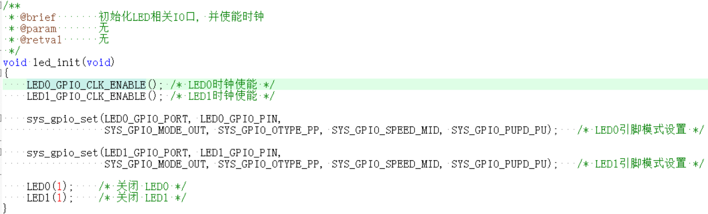
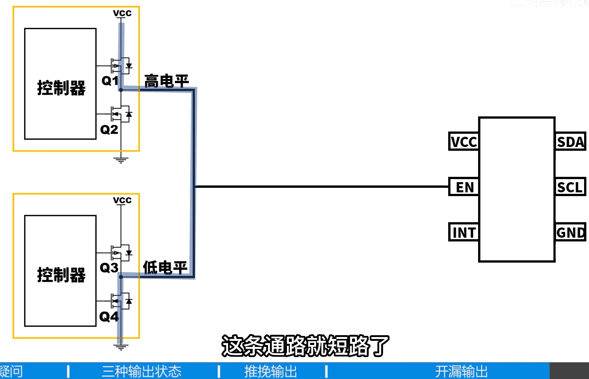
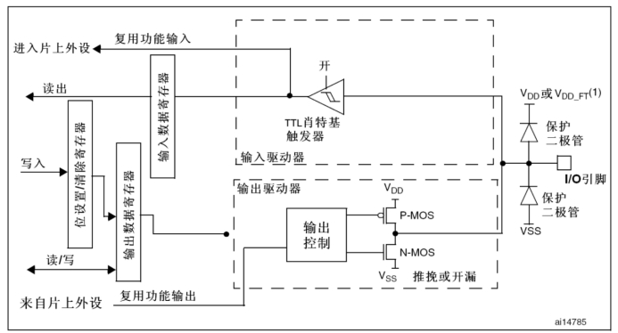
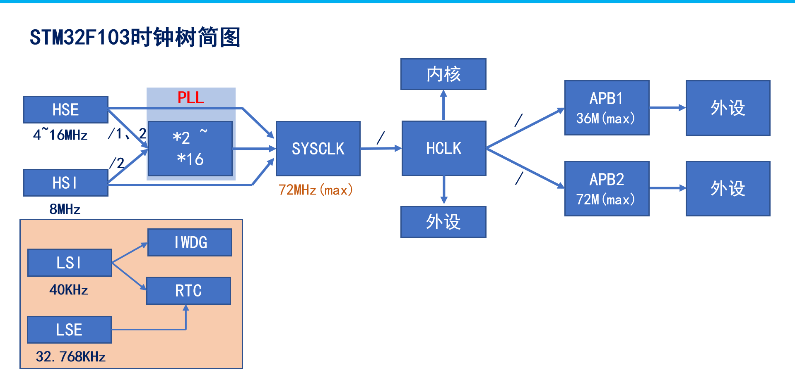
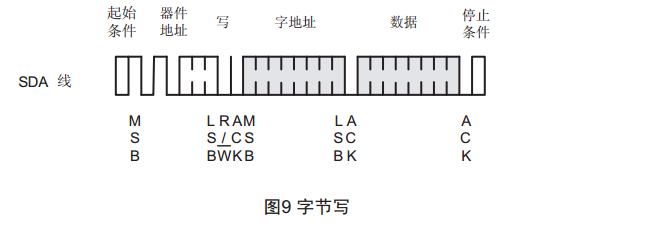

# STM32学习笔记

## 1.GPIO外设相关,2025/4/3

### 1.1用寄存器方式点亮LED灯

步骤:(以GPIOF--->Pin9为例)

```c
    //下面来尝试点亮  LED0 -- PF9 所控制
    //1.时钟配置,RCC寄存器对应的GPIOF时钟使能
    RCC->AHB1ENR |= 1<<5;
    // 2. 配置 Pin9 为输出模式
    GPIOF->MODER &= ~(3 << 18);     // 清除模式,2*9=18
    GPIOF->MODER |= 1 << 18;        // 通用输出模式（01）
    // 3. 配置输出速度为高速
    GPIOF->OSPEEDR &= ~(3 << 18);	//2*9=18
    GPIOF->OSPEEDR |= 2 << 18;      // 高速（10）
    // 4. 启用上拉电阻
    GPIOF->PUPDR &= ~(3 << 18);
    GPIOF->PUPDR |= 1 << 18;        // 上拉（01）
    // 5. 配置为推挽输出
    GPIOF->OTYPER &= ~(1 << 9);     // 清除类型（默认为推挽）
	while(1)//实现的是让LED闪烁的效果
	{
    // 6. 点亮 LED（假设低电平点亮）       
	GPIOF->BSRR = 1 << (9 + 16);     // BSRR高16位：Pin9置低 
    delay_ms(500);
    // 7. 熄灭 LED
    GPIOF->BSRR = 1 << 9;            // BSRR低16位：Pin9置高
    delay_ms(500);
//    GPIOF->ODR |= 1<<9; //熄灭
//    GPIOF->ODR &= ~(1<<9);//点亮,将控制语句换为这两句也是可以的,但是更加推荐上面的方式(原因如下)
	}
```

注意:

1. 在嵌入式开发中，**原子操作**（Atomic Operation）指的是一个不可被中断的完整操作——要么全部执行成功，要么完全不执行，中间不会被其他代码（如中断、多线程）打断。而 **"无需读-改-写"** 指的是不需要先读取寄存器当前值、修改特定位、再写回寄存器的传统流程，而是**直接通过寄存器设计实现单步原子操作**。

2. ##### 为什么需要原子操作？

   当多个代码（如主循环和中断）同时操作同一个寄存器时，传统的 **读-改-写**（Read-Modify-Write）流程可能引发 **竞态条件**（Race Condition）。例如：

   ```c
   // 假设在中断中操作GPIO的某个位：
   void Interrupt_Handler() {
       GPIOA->ODR |= 1 << 5; // 读-改-写：读取ODR，设置Bit5，再写回
   }
   // 主循环中同时操作另一个位：
   void main() {
       GPIOA->ODR |= 1 << 6; // 读-改-写
   }
   ```

   如果中断在主循环的 **读** 和 **写** 之间触发，主循环的修改会被中断的写入覆盖，导致数据不一致。

   3.STM32的解决方案：BSRR寄存器，STM32的GPIO模块提供了一个专用寄存器 **BSRR**（Bit Set/Reset Register），它的设计允许直接通过单次写操作设置或清除某个GPIO位，无需读-改-写，天然支持原子操作。

关键总结：

| 特性         | 读-改-写（ODR）      | BSRR原子操作         |
| :----------- | :------------------- | :------------------- |
| **操作步骤** | 读→改→写（3步）      | 直接写（1步）        |
| **竞态风险** | 高（可能被中断打断） | 无（单步原子操作）   |
| **代码效率** | 低（需要多次操作）   | 高（单指令完成）     |
| **适用场景** | 需要同时修改多个位   | 单一位或独立位的操作 |

### 1.2补充F407系列芯片手册与stm32f407xx.h头文件的关系


1.上两张图可以看出是一一对应的关系，即头文件中定义了一个结构体RCC_TypeDef，里边的成员变量是按照内存器表排序的


2.RCC是一个大的单元，他被宏定义成了一个（RCC_TypeDef*）RCC_BASE 的地址，一步步深挖，可以发现地址相加在一起，刚好是外设基地址+AHB1外设基地址+RCC的基地址，定位到RCC这个打的模块上


### 1.3尝试解读一下正点原子所给的一些封装好的代码

这是封装好的函数，我们看看他都干了些啥？



1. 使能时钟
2. GPIO复用功能设置

该函数逻辑

1. **循环遍历所有引脚（0到15）**

   ```c
   for (pinpos = 0; pinpos < 16; pinpos++)
   ```

   - GPIO端口通常有16个引脚（从0到15），通过循环逐个检查每个引脚是否需要配置。

2. **检查当前引脚是否需要配置**

   ```c
   pos = 1 << pinpos;      /* 生成当前引脚的掩码 */
   curpin = pinx & pos;    /* 检查引脚是否在pinx中 */
   if (curpin == pos)      /* 如果需要配置 */
   ```

   - `pos`是一个掩码，用于检查`pinx`中是否包含当前引脚（例如，`pinx`为`0x0001`表示第0引脚，`0x0002`表示第1引脚）。
   - 如果`curpin`等于`pos`，说明当前引脚需要配置。

3. **配置GPIO模式**

   ```c
   p_gpiox->MODER &= ~(3 << (pinpos * 2)); /* 清除原来的设置 */
   p_gpiox->MODER |= mode << (pinpos * 2); /* 设置新的模式 */
   ```

   - 每个GPIO引脚的模式由2位表示（`MODER`寄存器的每2位对应一个引脚）。
   - `~(3 << (pinpos * 2))`：生成一个掩码，将对应引脚的2位清零。
   - `mode << (pinpos * 2)`：将新的模式值左移到对应位置，并写入`MODER`寄存器。

4. **配置输出速度和输出类型（如果模式是输出或复用功能模式）**

   ```c
   if ((mode == 0X01) || (mode == 0X02))   /* 如果是输出模式或复用功能模式 */
   {
       p_gpiox->OSPEEDR &= ~(3 << (pinpos * 2));       /* 清除原来的设置 */
       p_gpiox->OSPEEDR |= (ospeed << (pinpos * 2));   /* 设置新的速度值 */
       p_gpiox->OTYPER &= ~(1 << pinpos);             /* 清除原来的设置 */
       p_gpiox->OTYPER |= otype << pinpos;             /* 设置新的输出模式 */
   }
   ```

   - **`OSPEEDR`寄存器**：用于设置GPIO引脚的输出速度。
   - **`OTYPER`寄存器**：用于设置GPIO引脚的输出类型（推挽或开漏）。
   - 只有当引脚模式为输出模式（`0x01`）或复用功能模式（`0x02`）时，才需要配置输出速度和输出类型。

5. **配置上下拉电阻**

   ```c
   p_gpiox->PUPDR &= ~(3 << (pinpos * 2)); /* 先清除原来的设置 */
   p_gpiox->PUPDR |= pupd << (pinpos * 2); /* 设置新的上下拉 */
   ```

   - **`PUPDR`寄存器**：用于配置GPIO引脚的上下拉电阻。
   - 每个引脚的上下拉电阻由2位表示，通过类似的操作清除旧值并设置新值。

总结一下，这个函数就是把这块开发板对应的端口做了封装，对于GPIOx(A,B...)进行了封装,使得通过上边的一个函数对所有的GPIO进行初始化配置,其代码本质上还是在控制各类寄存器(将1.1的部分又封装了一层,并且使其具有通用性)

3.GPIO引脚输出电平的控制


**可以清除的发现也是通过控制BSRR来控制引脚的高低电平的**

### 1.4GPIO基本结构分析


**① 保护二极管**:

保护二极管共有两个，**用于保护引脚外部过高或过低的电压输入。当引脚输入电压高于VDD 时**（意味着这个保护电路往往是在输入模式的情况下才会生效），上面的二极管导通，当引脚输入电压低于 VSS 时，下面的二极管导通，从而使输入芯片内部的电压处于比较稳定的值。虽然有二极管的保护，但这样的保护却很有限，大电压大电流的接入很容易烧坏芯片。所以在实际的设计中我们要考虑设计引脚的保护电路。

**② 上拉、下拉电阻**

它们阻值大概在 30~50K 欧之间，可以通过上、下两个对应的开关控制，这两个开关由寄存器控制。当引脚外部的器件没有干扰引脚的电压时，即没有外部的上、下拉电压，引脚的电平由引脚内部上、下拉决定，开启内部上拉电阻工作，引脚电平为高，开启内部下拉电阻工作，则引脚电平为低。同样，如果内部上、下拉电阻都不开启，这种情况就是我们所说的浮空模式。浮空模式下，引脚的电平是不可确定的。引脚的电平可以由外部的上、下拉电平决定。

注意:感谢铁头山羊的GPIO讲解，让我知道了，当io输入断开时，单片机内部犹如一个无限大阻值的电阻，io引脚就像个条线，会接受电磁信号，这对32的输入是干扰源的存在因此需要适时的开启上拉下拉电阻，保证引脚处于一个高或者低对的电平，杜绝电磁信号的干扰，并且当单片机复位之后所有gpio都会被设置为符空状态，达到高阻抗状态(起到安全，节能的作用)

**③施密特触发器**,存在于输入部分


**④** **P-MOS** **管和** **N-MOS** **管**

这个结构控制 GPIO 的开漏输出和推挽输出两种模式。开漏输出：输出端相当于三极管的集电极，要得到高电平状态需要上拉电阻才行。推挽输出：这两只对称的 MOS 管每次只有一只导通，所以导通损耗小、效率高。输出既可以向负载灌电流，也可以从负载拉电流。推拉式输出既能提高电路的负载能力，又能提高开关速度。

#### 1.4.1推挽输出


通过	控制置位/复位寄存器间接控制输出数据寄存器	或	直接控制输出数据寄存器来控制P-Mos和N-Mos的通断进而实现

"推电流,挽电流"的操作,直接将引脚置为高低电平，此时要注意输入数据部分是被打开的，意思是，我们可以读取当前IO口的状态。

**特性**

- **驱动能力强**：能直接输出高/低电平，无需外部上拉电阻。
- **高低电平切换速度快**：适合高速信号（如SPI、PWM）。
- **无外部元件依赖**：独立驱动负载（如LED、继电器）。

**典型应用**

- 需要强驱动能力的场景：LED控制、数字信号传输（SPI、USART）。
- 单设备独占总线的情况

#### 1.4.2开漏输出


**开漏模式下，P-MOS 管是一直截止的，**所以 P-MOS 管的栅极一直接 VSS。

如果输出数据寄存器设置为 0 时，经过“输出控制”的逻辑非操作后，输出逻辑 1 到 N-MOS 管的栅极，这时 N-MOS 管就会导通，使得 I/O 引脚接到 VSS，即输出低电平。

如果输出数据寄存器设置为 1 时，经过“输出控制器”的逻辑非操作后，输出逻辑 0 到 N-MOS 管的栅极，这时 N-MOS 管就会截止。

**因为 P-MOS 管是一直截止的，使得 I/O 引脚呈现高阻态，即不输出低电平，也不输出高电平。**因此要 I/O 引脚输出高电平就必须接上拉电阻。这时可以接内部上拉电阻，或者接一个外部上拉电阻。由于内部上拉电阻的阻值较大，所以只是“弱上拉”。需要大电流驱动，请接外部的上拉电阻。此外，**上拉电阻具有线与特性，即如果有很多开漏模式的引脚连在一起的时候，只有当所有引脚都输出高阻态，电平才为 1，只要有其中一个为低电平时，就等于接地，使得整条线路都为低电平 0。我们的 IIC 通信（IIC_SDA）就用到这个原理。**另外在开漏输出模式下，施密特触发器是打开的，所以 IO 口引脚的电平状态会被采集到输入数据寄存器中，如果对输入数据寄存器进行读访问可以得到 IO 口的状态。**也就是说开漏输出模式下，我们可以对 IO 口进行读数据。**

**特性**

- **电平灵活性**：通过外部上拉电阻可适配不同电压（如3.3V或5V系统）。
- **总线共享**：支持“线与”逻辑，多个设备可共享同一总线（如I2C）。
- **驱动能力弱**：高电平依赖外部上拉电阻，上升沿可能较慢。

**典型应用**

- 多设备总线通信：I2C、SMBUS（避免总线冲突）。
- 电平转换：连接不同电压的器件。
- 需要“线与”逻辑的场景（如多中断信号共享）。

**两种输出方式的关键对比**

| **特性**         | **推挽输出**         | **开漏输出**              |
| :--------------- | :------------------- | :------------------------ |
| **电路结构**     | P-MOS + N-MOS        | 仅N-MOS，P-MOS关闭        |
| **高电平驱动**   | 直接由VDD提供        | 依赖外部上拉电阻          |
| **低电平驱动**   | 直接由GND提供        | 直接由GND提供             |
| **电平切换速度** | 快（双MOS驱动）      | 慢（依赖上拉电阻）        |
| **总线冲突风险** | 高（可能短路）       | 低（支持线与逻辑）        |
| **典型应用**     | LED、SPI、单设备通信 | I2C、电平转换、多设备总线 |

**应用示例**

- **I2C总线**：必须使用开漏模式，配合上拉电阻实现多设备通信。

- **5V传感器接口**：开漏模式+外部5V上拉，实现3.3V MCU与5V传感器电平兼容。

- **LED控制**：推挽模式直接驱动，无需额外电路

  

  #### 示例:（下边的示例都需要上拉电阻，来提供支持）


假设使用图一的推挽输出，就难以实现5v的MCU对3.3V芯片的控制，而使用开漏输出下边这个Mos管的开闭配合外部上拉电阻，就实现了控制。



当需要实现，**几个GPIO控制一个芯片这样的需求的时候，推挽就容易出现上边的情况（Mos烧毁）**


开漏输出的好处，便体现了出来

#### 1.4.3复用输出（2025/4/4）



（1）在开漏或推挽式配置中，输出缓冲器被打开。

（2）内置外设的信号驱动输出缓冲器（复用功能输出）。

（3）施密特触发输入被激活。

（4）弱上拉和下拉电阻被禁止。（因为输入时才需要上下拉电阻）

复用输出与通用输出的最大区别就在于，数据的来源，前者来自于其他的片上外设，后者来自于MUC内部，因而你可以看到	输出数据寄存器	是出于一个被断开的状态

#### 1.4.4输入模式


（1）2个保护二极管的作用是保护我们的芯片不会由于电压过高或过低而烧毁。

VDD是接电源（3.3V），VSS接地（0V）。如果IO引脚的输入电压高于VDD的值到一定程度，上方保护二极管导通，则引脚电压被拉低到VDD。如果IO引脚的输入电压（负电压）低于VSS到一定程度，则下方保护二极管导通，电压被拉高到VSS。

（2）2个开关控制引脚在没有输入的时候是上拉，下拉还是浮空。当上面的开关闭合的时候，输入被拉高到高电平。当下面的开关闭合的时候，输入被拉低到低电平。如果两个都不闭合，输入就是悬空状态。两个同时闭合，就是费电了，不会这么做的。

- 输入浮空（Input floating）
- 输入上拉（Input pull-up）
- 输入下拉（Input-pull-down）

 

（3）施密特（图中翻译成肖特基触发器应该是翻译错误，英文版手册是TTL Schmitt trigger）触发器是包含正反馈的比较器电路。可以对信号进行波形整形。

 

 

（4）从施密特触发起出来的数据，进入到输入数据寄存器中，我们就可以从中读取数据了。

#### 1.4.5模拟输入


当配置为模拟输入时：

（1）输出部分被禁止。

（2）**禁止施密特触发输入**，实现了每个模拟I/O引脚上的零消耗。施密特触发输出值被强置为0。

（3）弱上拉和下拉电阻被禁止。

（4）读取输入数据寄存器时数值永远为0。

### 1.5GPIO相关寄存器

#### 1.5.1STM32F103系列

每个GPIO端口有7个相关的寄存器：

Ø 2个32位**配置寄存器**（GPIOx_CRL，GPIOx_CRH）。

Ø 2个32位**数据寄存器**（GPIOx_IDR和GPIOx_ODR）。

Ø 1个32位**置位/复位寄存器**（GPIOx_BSRR）。

Ø 1个16位复位寄存器（GPIOx_BRR）。

Ø 1个32位锁定寄存器（GPIOx_LCKR）。****

1.1.1 **GPIOx_CRL****（端口配置低寄存器）**

GPIOx_CRL（Port configuration register low），x可以是A-G。

 

该寄存器配置的每个GPIO的 0-7 这个8个位，所以叫低寄存器。

**1）*****\*MODE：\*******\*每个端口有2个MODE位进行控制。\****

00：输入模式（复位后的状态） 

01：输出模式，最大速度10MHz 

10：输出模式，最大速度2MHz 

11：输出模式，最大速度50MHz

**2）*****\*CNF：\*******\*每个端口有2个CNF位进行控制。\****

（1）当MODE是00 （输入模式）

00：模拟输入模式 

01：浮空输入模式(复位后的状态) 

10：上拉/下拉输入模式 

11：保留 

（2）当MODE>00（输出模式）

00：通用推挽输出模式 

01：通用开漏输出模式 

10：复用功能推挽输出模式 

11：复用功能开漏输出模式

1.1.2 **GPIOx_CR****H（端口配置高寄存器）**

GPIOx_CRH（Port configuration register high）。

该寄存器配置的是每个端口的 8-15引脚，配置方式和低位寄存器完全一样。

1.1.3 **GPIOx_IDR****（端口输入数据寄存器）**

Port input data register

 

保留位始终读为0。剩下的分别对应每个引脚的输入值。

1.1.4 **GPIOx_ODR****（端口输出数据寄存器）**

Port output data register

 

保留位始终读为0。剩下的分别对应每个引脚的输出值。

1.1.5 **GPIOx_BSRR****（端口位设置****/****清除寄存器）**

Port bit set/reset register

 

（1）高16位是用清除对应的数据输出寄存器的位（0-15）的值：设置为0不影响，设置为1会清除ODR对应的位的值（置为0）。

（2）低16位是用设置对应的数据输出寄存器的位（0-15）的值：设置为0不影响，设置为1会设置ODR对应的位的值（置为1）。

1.1.6 **GPIOx_BRR****（端口位清除寄存器）**

这个寄存器具有了***\*GPIOx_BSRR\*******\*一半的功能：清除\****。

 

1.1.7 **GPIOx_LCKR****（端口配置锁定寄存器）**

Port configuration lock register

 

该寄存器用来锁定端口位的配置。位[15:0]用于锁定GPIO端口的配置。在规定的写入操作期间，不能改变LCKR[15:0]。当对相应的端口位执行了LOCK序列后，在下次系统复位之前将不能再更改端口位的配置。

每个锁定位锁定控制寄存器（CRL，CRH）中相应的4个位（CNF2位和MODE2位）。

**第16位用来激活锁定寄存器，必须按照规定的时序来操作才行: 写1 -> 写0 -> 写1 -> 读0 -> 读1**。

对0-15位：

Ø 0：不锁定对应端口的配置。

Ø 1：锁定对应端口的配置。

注意:F103的配置寄存器相比F407的容易一些,并且锁存寄存器我们用的比较少,0-15位就相当于给GPIO配置的模式一个锁,让其在程序运行的时间段内不会有所改变,而第16位则相当于前16位的总的钥匙,要开启他(使用密码序列),才能进行后续的工作.

#### 1.5.2STM32F407系列

每个通用 I/O 端口包括 :

4 个 32 位配置寄存器（GPIOx_MODER、GPIOx_OTYPER、GPIOx_OSPEEDR 和 GPIOx_PUPDR）

2 个 32 位数据寄存器（GPIOx_IDR 和GPIOx_ODR）

1 个 32 位置位/复位寄存器 (GPIOx_BSRR)

1 个 32 位锁定寄存器(GPIOx_LCKR) 

 2 个 32 位复用功能选择寄存器（GPIOx_AFRH 和 GPIOx_AFRL）

具体配置情况,参见中文参考手册p187

**注意：我们在学习一个模块的时候可以先简单的浏览他的基本功能描述，再看手册的每章最后一节去看寄存器地址印射表，这样就可以大概知道该模块用到了哪些寄存器，在一一的去看单个寄存器。**

### 1.6写案例时遇到的一些问题

在写流水灯案例的时候我遇到了许多的麻烦,如果简单的调用人家封装好的函数可以避免这些麻烦,但是也失去了解决麻烦的机会,下面我将遇到的问题汇总如下:

#### 1.6.1层级目录结构


#### 1.6.2uint8_t、uint16_t、uint32_t?（第6点一定要注意）

在嵌入式编程中选择使用`uint32_t`还是`uint8_t`时，需综合考虑以下因素：

---

**1. 数值范围**

- **`uint8_t`**：取值范围 **0~255**，适用于小数值（如状态标志、ASCII字符、传感器的小范围原始数据）。
- **`uint32_t`**：取值范围 **0~4,294,967,295**，适用于大数值（如高精度计时器、内存地址、大计数器）。

**示例**：  

```c
// 用 uint8_t 表示LED状态（0或1）
void set_led(uint8_t state);

// 用 uint32_t 表示系统运行时间（单位：毫秒）
uint32_t get_system_uptime(void);
```

---

**2. 内存优化**

- **`uint8_t`**：节省内存，尤其在**大量数据存储**时（如数组、缓冲区）。  
  例如：`uint8_t sensor_data[1024]` 占用 **1KB**，而 `uint32_t` 会占用 **4KB**。
- **`uint32_t`**：占用更多内存，但避免频繁的类型转换和溢出风险。

**权衡**：  
在资源极度受限（如8位MCU、小RAM）的系统中优先考虑`uint8_t`，否则优先代码安全性和可维护性。

---

**3. 处理器效率**

- **8/16位MCU**：`uint8_t`操作通常更高效（原生支持单字节操作）。
- **32/64位MCU**：`uint32_t`可能更高效（与寄存器位宽匹配，减少指令周期）。

**示例**：  
在32位ARM Cortex-M中，对`uint32_t`的读写通常是原子操作，适合操作硬件寄存器。

---

**4. 硬件接口要求**

- **寄存器/外设**：必须与硬件位宽严格匹配。  
  例如：32位DMA地址寄存器 → `uint32_t`，8位UART数据寄存器 → `uint8_t`。
- **协议规范**：遵循通信协议定义（如I2C用`uint8_t`传输，CAN报文可能用`uint32_t`）。

**示例**：  
```c
// 写入32位硬件定时器寄存器
#define TIMER_RELOAD (*(volatile uint32_t*)0x40001000)
void set_timer(uint32_t value) {
    TIMER_RELOAD = value; // 必须用 uint32_t
}
```

---

**5. 函数参数与性能**

- **频繁调用的函数**：参数类型可能影响性能。  
  - 在32位系统中，传递`uint8_t`可能被填充到32位栈空间，无内存节省。
  - 但大量参数时（如结构体），`uint8_t`仍有意义。
- **跨模块接口**：明确类型避免隐式转换（如`uint8_t`强制转换为`int`可能引入问题）。

**示例**：  
```c
// 高效结构体设计（节省内存）
typedef struct {
    uint8_t temperature;  // 温度值0~100°C
    uint32_t timestamp;    // 时间戳
} SensorData;
```

---

**6. 防止溢出与类型提升**

- **运算与类型提升**：C语言中，小类型参与运算时会被提升为`int`（可能导致意外结果）。  
  **示例**：  
  
  ```c
  uint8_t a = 200;
  uint8_t b = 100;
  uint8_t c = a + b; // 溢出！实际300 > 255，结果为44（错误）
  ```
  若涉及运算，优先使用`uint32_t`或在代码中显式检查范围。

---

**决策流程图**

```plaintext
是否受硬件/协议约束？
├─ 是 → 使用硬件/协议规定的类型
└─ 否 → 数值是否超过255？
    ├─ 是 → 使用 uint32_t
    └─ 否 → 是否内存敏感？
        ├─ 是 → 使用 uint8_t
        └─ 否 → 是否频繁参与运算？
            ├─ 是 → 优先 uint32_t
            └─ 否 → 默认 uint8_t（提高可读性）
```

---

**总结建议**

1. **硬件相关**：严格匹配硬件位宽（如寄存器、外设驱动）。
2. **数据存储**：大量数据时优先`uint8_t`，单个数据优先可读性。
3. **运算安全**：可能涉及大数值运算时用`uint32_t`。
4. **代码可维护性**：使用明确类型（如`uint8_t`表示字节，`uint32_t`表示资源句柄）。

通过权衡这些因素，可以避免内存浪费、硬件错误和隐蔽的溢出问题。

#### 1.6.3嵌入式中的数据溢出和整形提升


## 2.STM32总线架构和时钟树系统

这里我将试图分别介绍一下103和407系列芯片的这两大系统，供自己复习使用。

最开始学stm32开始对架构各部分不是很了解看架构图基本上走马观花，然后陷入对各个外设的投入中去（比如GPIO/ADC/CAN等），但是对整体架构的掌握对后面编程很多细节的理解帮助很大，而外设的使用是学不完的，无需沉溺其中。

### 2.1F103和F407系统总线


此图对应下面这张图左边红框是ARM设计（内核），右边是ST公司设计（外设及其与内核的交互方式），ARM公司是设计芯片内核的公司，将专利授权给STM公司后，STM公司在内核如CotexM3的基础上进行设计，如外设和内核如何传递信息、外围设计哪些外设等。最后将整体封装引脚引出交付给买家。


如上图就是对系统结构进一步细化：
看这个图先要搞清楚驱动和被动单元是哪几个？
在小容量、中容量和 大容量产品中，主系统由以下部分构成：
● 四个驱动单元：
─ Cortex™-M3内核DCode总线(D-bus)，和系统总线(S-bus)
─ 通用DMA1和通用DMA2
● 四个被动单元
─ 内部SRAM
─ 内部闪存存储器FLASH
─ FSMC
─ AHB到APB的桥(AHB2APBx)，它连接所有的APB设备

1. 首先Cotex-M3内核通过ICode总线（Instruction）在Flash里面读取指令（就是你烧进去的代码）。
2. DCode总线(Data)用来读取存储在SRAM里面的数据，这里的数据就是程序里定义的数据(包括变量和常量，常量用const修饰后存储在Flash中)，不管是全局变量extern还是局部变量static都是存储在SRAM里面。
    3.系统总线System Bus 主要是用来对外设的寄存器进行操作。
    4.**DMA总线可以访问FLASH、SRAM、数据寄存器，并在三者间快速交换数据。**可以绕过内核，让内核可以腾出手做其他的事情
    5.AHB总线桥接成APB1和APB2，众多外设分别挂载在这两条总线上，所以**编程时你会发现所有片上外设的寄存器地址都是基于AHB总线地址定义的**。


左边框图，主要有M3内核和两个DMA和一些其他总线，其中ICODE总线中的I代表Instruction（指令）的意思，这个总线转梦是用来传输指令的，在此之前，先理解片内闪存FLASH，它是一种非易失性存储器，即掉电不丢失数据可以理解为硬盘，它的缺点在于不能以字节方式查信息，写一个字节就需要对整个扇区全部重写（擦除操作限制：在擦除操作时，需要一次性擦除整个块的数据，不能单独擦除某个数据位。），因而它不适宜用来写操作，在单片机中他是用来存放指令的，代码编译为十六进制后，通过ST-Link烧录到Flash当中，也只有在此时才会对flash进行写操作，单片机在运行的过程中，需要将程序指令读取出来一一执行，这一过程就是通过ICODE总线实现的，FLITF是闪存接口（总线和）。静态随机存取存储器 --- SRAM：掉电后数据流失，但读写极快，用于暂存数据（变量）。

DCODE中的D代表Data数据，它是供M3内核处理数据用的，当内核要用到常量的时候数据走路径①，用到变量的时候走路径②。

剩下的其他外设如果需要和内核进行数据交换就需要通过System总线来完成，总线矩阵的作用是当众多外设都给内核交换数据，那么需要通过总线仲裁，来保证数据有序通过。


总线矩阵用来在多个主设备（驱动单元）和从设备（被动单元）之间进行调度，避免两个主设备同时对一个从设备读写的情形。图中标有圆点的表示这两个设备间可以通信。比如 S0：I 总线只有跟 M0、M2 和 M6 这三根被控总线交叉的时候才有圆圈，就表示 S0 只能跟这三根被控总线通信。从功能上来理解，I 总线是指令总线，用来取指，指令指的是编译好的程序指令。我们知道 STM32 有三种启动方式，从 FLASH 启动（包含系统存储器），从内部 SRAM 启动，从外部 RAM 启动，这三种存储器刚好对应的就是M0、M2 和 M6 这三条总线。

举例：当多个AHB 主设备试图同时访问同一个AHB从设备时，总线矩阵仲裁器介入以解决访问冲突。在下面的例子中CPU 和DMA1 均试图访问SRAM1 以读取数据。

如上述示例总线访问请求同时发生的情况下，就需要总线矩阵仲裁。为了解决这种问题，需要应用循环调度策略：如果本次最后赢得总线控制权的主设备是CPU，则在下一次访问中DMA1将赢得总线控制权并首先访问SRAM1。

https://blog.csdn.net/salty_fish_y/article/details/122048404

### 2.2时钟树

为什么提供这么多的时钟？节能！高速设备接高速时钟，低速设备接低速时钟，可以最大程度的**达到节能效果**。


https://www.bilibili.com/video/BV1sY411r7fV/?spm_id_from=333.1391.0.0&vd_source=277cb2db6fb565ba93c0f1b14b491742

时钟树的讲解和上边总线架构的讲解可以参照视屏





### 2.3CubeMX中的时钟树配置

对于F407系列芯片来说,它的系统最大时钟是168MHz,我们在使用CubeMX配置RCC的时候注意下边的几个选项框,就可以得到正确的时钟配置了


从左至右,选高速外部晶振,锁相环输出168MHz的系统时钟频率，也可选择好前两个框之后，后边直接输入168让系统自动配置参数，这样最方便。

### 2.4CubeMX初体验

完整的创建一个该工程步骤，可以参见F407探索者开发指南，或者尚硅谷视频

## 3.系统中断

打断CPU执行正常的程序，转而处理紧急程序，然后返回原暂停的程序继续运行，就叫中断.

中断的意义：高效处理紧急程序，不会一直占用CPU资源.

#### 3.1相关寄存器


##### 3.1.1NVIC

Nested vectored interrupt controller，嵌套向量中断控制器，属于内核，NVIC支持：256个中断（16内核 + 240外部），支持：256个优先级，允许裁剪，也就是根据芯片的不同需求定制出优先级少一些，支持外部中断少一些的芯片。


我们还应当认识到什么是中断向量表：即定义一块固定的内存，以4字节对齐，存放各个中断服务函数程序的首地址，中断向量表定义在启动文件，当发生中断，CPU会自动执行对应的中断服务函数。如下图，**主函数正常的顺序执行各种逻辑，但是当我们定义的外部中断到来之后，就会触发外部中断函数，这个外部中断函数需要我们根据具体需要CPU执行哪些逻辑来书写，最重要的一点是，主函数的某个操作被打断，然后单片机会去查询中断向量表，找到对应的中断服务程序的入口地址，跳转到该处执行你需要的新操作，而后清除中断标志位，主函数继续未完成的工作。**


由于NVIC很靠近内核，我们只需要知道他的简单工作原理即可，正式使用时，只需要对中断的优先级分组进行设置，对其抢断优先级和响应优先级有所设置，并且使能对应中断线路即可。


| 分组 | 抢占优先级         | 响应优先级         |
| ---- | ------------------ | ------------------ |
| 0    | 0位 取值范围：0    | 4位 取值范围：0-15 |
| 1    | 1位 取值范围：0-1  | 3位 取值范围：0-7  |
| 2    | 2位 取值范围：0-3  | 2位 取值范围：0-3  |
| 3    | 3位 取值范围：0-7  | 1位 取值范围：0-1  |
| 4    | 4位 取值范围：0-15 | 0位 取值范围：0    |

**NVIC对优先级分了5组，在程序中先对中断进行分组，而且分组只能分一次，若多次分，只有最后一次生效。**

##### 3.1.2EXTI

外部中断/事件控制器包含多达 23 个用于产生事件/中断请求的边沿检测器。每根输入线都可 单独进行配置，以选择类型（中断或事件）和相应的触发事件（上升沿触发、下降沿触发或边沿触发）。每根输入线还可单独屏蔽。挂起寄存器用于保持中断请求的状态线。

GPIO外部输入控制中断主要是走下面红色箭头路线，我们只需要配置好相关寄存器就好


哪里来的23根线呢？


一定要重点认识红框中的寄存器，一般我们配置这几个寄存器就可以把GPIO的外部输入中断配置明白了。

##### 3.1.3SYSCFG

###### 1.EXTI与IO的对应关系


#### 3.2如何使用中断


下面的初始化函数，就是想通过一个按键来实现中断的配置过程：

1、2步是开启对应的时钟并且设置GPIO为输入（上拉或者下拉模式，这取决于电路图）

3、SYSCFG寄存器的作用是将对应中断线映射到EXTI上

4、配置EXTI相关寄存器，如上升沿下降沿事件屏蔽寄存器，请求挂起寄存器（这个由硬件置位，需要在中断处理函数中对其进行复位，清除中断标志）

5、NVIC配置优先级，直接使用提供的函数来实现，最后使能中断即可


6、中断处理函数中要学会清除PR寄存器

注意：**避免长时间操作**：中断服务函数应该尽可能简短，避免执行耗时操作，比如延时、复杂的计算等。长时间的中断处理会影响系统实时性，可能导致其他中断无法及时响应。如果需要处理复杂任务，可以考虑在中断中设置标志位，在主循环中处理。

#### 3.3其他注意点

在STM32中，处理EXTI0-4、EXTI5-9和EXTI10-15的中断服务函数时，需注意以下关键点：

##### **1. 中断服务函数命名**
- **EXTI0-4**：每个中断线有独立的服务函数，命名必须为：
  ```c
  void EXTI0_IRQHandler(void)  // EXTI0
  void EXTI1_IRQHandler(void)  // EXTI1
  void EXTI2_IRQHandler(void)  // EXTI2
  void EXTI3_IRQHandler(void)  // EXTI3
  void EXTI4_IRQHandler(void)  // EXTI4
  ```
- **EXTI5-9**：共享一个服务函数，命名为：
  ```c
  void EXTI9_5_IRQHandler(void)
  ```
- **EXTI10-15**：共享一个服务函数，命名为：
  ```c
  void EXTI15_10_IRQHandler(void)
  ```

---

##### **2. 检查中断标志（共享中断线）**
对于共享中断线（EXTI5-9和EXTI10-15），需在服务函数内遍历检查所有可能的中断源：
```c
// EXTI5-9 示例
void EXTI9_5_IRQHandler(void) {
    if (EXTI_GetITStatus(EXTI_Line5) != RESET) {
        // 处理EXTI5中断
        EXTI_ClearITPendingBit(EXTI_Line5);
    }
    if (EXTI_GetITStatus(EXTI_Line6) != RESET) {
        // 处理EXTI6中断
        EXTI_ClearITPendingBit(EXTI_Line6);
    }
    // ... 检查EXTI7、EXTI8、EXTI9
}
```

---

##### **3. 清除中断标志**
- 处理完成后必须清除对应中断线的挂起标志，防止重复触发。
- **推荐方法**：
  ```c
  EXTI_ClearITPendingBit(EXTI_Linex);  // 标准库
  __HAL_GPIO_EXTI_CLEAR_IT(GPIO_PIN_x);  // HAL库
  ```

---

##### **4. 中断优先级配置**
- 通过NVIC设置优先级，确保关键中断优先响应：
  ```c
  NVIC_InitTypeDef NVIC_InitStruct;
  NVIC_InitStruct.NVIC_IRQChannel = EXTI0_IRQn;  // 以EXTI0为例
  NVIC_InitStruct.NVIC_IRQChannelPreemptionPriority = 0;
  NVIC_InitStruct.NVIC_IRQChannelSubPriority = 0;
  NVIC_InitStruct.NVIC_IRQChannelCmd = ENABLE;
  NVIC_Init(&NVIC_InitStruct);
  ```

---

##### **5. 高效中断设计**
- **保持简短**：避免复杂操作（如延时、打印），改用标志位通知主循环。注意**`volatile`**关键字的使用。

- ```c
  volatile int i=10; //中断服务程序的标志位常用关键字,用来表示寄存器状态
  int j = i; 
  ...
  int k = i;
  ```

  **volatile 告诉编译器i是随时可能发生变化的，每次使用它的时候必须从i的地址中读取，因而编译器生成的可执行码会重新从i的地址读取数据放在k中。** 

  **而优化做法是，由于编译器 发现两次从i读数据的代码之间的代码没有对i进行过操作，它会自动把上次读的数据放在k中。而不是重新从i里面读。**

  **这样以来，如果i是一个寄存器变量或者表示一个端口数据就容 易出错，所以说volatile可以保证对特殊地址的稳定访问，不会出错。**

- **防重入**：使用`__disable_irq()`和`__enable_irq()`临时关闭中断（谨慎使用）。

---

##### **6. 触发模式选择**
- **边沿触发**（推荐）：避免电平触发下的“中断风暴”。
- **软件消抖**：若信号有噪声，需在硬件或软件中添加滤波。-->  比如按键会需要一个旁路电容(硬件去抖动)

---

##### **7. GPIO与时钟配置**
- 确保GPIO时钟和AFIO时钟已使能：
  ```c
  RCC_APB2PeriphClockCmd(RCC_APB2Periph_GPIOA | RCC_APB2Periph_AFIO, ENABLE);
  ```
- 配置GPIO为输入模式并绑定到EXTI线：
  ```c
  GPIO_InitStructure.GPIO_Mode = GPIO_Mode_IPU;  // 上拉输入
  EXTI_InitStructure.EXTI_Line = EXTI_Line0;     // 绑定到EXTI0
  ```

---

**常见问题**

- **中断未触发**：检查NVIC配置、EXTI线绑定、GPIO模式及时钟。
- **重复进入中断**：确认中断标志已清除，触发模式设置正确。
- **共享中断遗漏处理**：确保遍历检查所有可能的中断线。

---

**示例代码（EXTI10-15）**

```c
void EXTI15_10_IRQHandler(void) {
    if (__HAL_GPIO_EXTI_GET_IT(GPIO_PIN_10) != RESET) {
        // 处理EXTI10
        __HAL_GPIO_EXTI_CLEAR_IT(GPIO_PIN_10);
    }
    if (__HAL_GPIO_EXTI_GET_IT(GPIO_PIN_11) != RESET) {
        // 处理EXTI11
        __HAL_GPIO_EXTI_CLEAR_IT(GPIO_PIN_11);
    }
    // ... 检查EXTI12-15
}
```

遵循以上要点，可确保外部中断的正确响应与高效处理，同时避免常见错误。

## 4.USART串口通信

简单介绍一下,数据通信的基本概念,包括,串行通信/并行通信,单工通信/双工通信/并行通信,同步/异步通信.

### 4.1基本的通讯概念

串口通信协议，我突然觉得协议是一个重要的东西，他是双方约定好的做事规范，也是编程时需要考量的东西。

可通过对 USART_CR1 寄存器中的 M 位进行编程来选择 8 位或 9 位的字长（请参见*图* *247*）。TX 引脚在起始位工作期间处于低电平状态。在停止位工作期间处于高电平状态。**空闲字符**可理解为整个帧周期内电平均为“1”（停止位的电平也是“1”），该字符后是下一个数据帧的起始位。**停止字符**可理解为在一个帧周期内接收到的电平均为“0”。发送器在中断帧的末尾插入 1 或 2 个停止位（逻辑“1”位）以确认起始位。


#### 1. **串行通信 vs 并行通信**

- **串行通信**
  - **定义**：数据逐位（bit）依次传输，仅需一条信道（如RS-232、USB）。
  - **特点**：成本低、抗干扰强，**适合远距离**（如网络传输），但速度相对较慢。
- **并行通信**
  - **定义**：多位数据同时通过多条并行信道传输（如旧式打印机接口）。
  - **特点**：**速度快**（理论上是串行的N倍，N为信道数），但成本高、易受干扰，仅适**用于短距离**.

------

#### 2. **单工、半双工与全双工通信**

- **单工（Simplex）**
  - 单向传输，一方固定为发送端，另一方为接收端（如广播、电视）。
- **半双工（Half-Duplex）**
  - 双向传输，但同一时间只能单向通信（如对讲机、Walkie-Talkie）。
- **全双工（Full-Duplex）**
  - 双向同时传输，需两条独立信道或频分复用（如电话、网络通信）。

------

#### 3. **同步通信 vs 异步通信**

- **同步通信**
  - **定义**：收发双方通过共享时钟信号或同步字符严格同步数据帧。
  - **特点**：高效（无冗余位），适合高速传输（如光纤通信），但对时序要求严格。
- **异步通信**
  - **定义**：以字符为单位传输，每字符添加起始/停止位标识时序（如UART）。
  - **特点**：灵活、适应性强，但效率较低（因额外开销），常用于低速设备（如键盘）。

------

#### 关键区别总结

| **维度**     | **类型**           | **核心特点**                 |
| :----------- | :----------------- | :--------------------------- |
| **传输方式** | 串行 vs 并行       | 速度 vs 抗干扰能力           |
| **方向性**   | 单工/半双工/全双工 | 单向、交替双向或同时双向     |
| **时序控制** | 同步 vs 异步       | 时钟同步需求 vs 字符级自同步 |

这些概念是通信协议设计的基础，实际应用中常结合使用（如全双工串行异步通信）

### 4.2	RS-232、RS-485、RS-422 、USART的区别

RS-232、RS-485、RS-422 **是物理层通信标准**，而 **USART**（Universal Synchronous/Asynchronous Receiver/Transmitter）是单片机内部的串行通信外设模块。它们之间的关系和区别如下：

1. **USART 是单片机内部的串口模块，输出 TTL 电平，不能直接用于 RS-232/485/422 通信**，必须通过电平转换芯片。

   

2.我们的STM32单片机往往通过USB转串口来实现通信


### 4.3时钟与波特率

**STM32提供了串口异步通讯，异步通讯中由于没有时钟信号，所以两个通讯设备之间需要约定好波特率，即每个码元的长度，以便对信号进行解码。**(这里有必要说一下,我在CubeMx中因为将时钟评率搞错了,导致波特率出了问题,发送接收的数据老是出错,一定要注意)

这部分的主要功能就是为 USART 提供时钟以及配置波特率。波特率，即每秒钟传输的码元个数，在二进制系统中（串口的数据帧就是二进制的形式），波特率与波特率的数值相等，所以我们今后在把串口波特率理解为每秒钟传输的二进制位数。波特率通过以下公式得出：

​									**𝑏𝑎𝑢𝑑 =𝑓𝑐𝑘/(16 ∗ USARTDIV)**

fck 是给串口的时钟（USART2\3 和 UART4\5 的时钟源为 PCLK1(**42MHz**)，USART1\6 的时钟源为PCLK2(84MHz)），USARTDIV 是一个无符号的定点数，**存放在波特率寄存器（USART_BRR）的低 16位，DIV_Mantissa[11:0] 存放的是 USARTDIV 的整数部DIV_Fractionp[3:0]存放的是USARTDIV 的小数部分。**

下面举个例子说明：当串口 1 设置需要得到 115200 的波特率，fck = 84MHz，那么可得：**115200 =84000000/(16 ∗ USARTDIV)**得到 USARTDIV ≈ 45.5729，分离 USARTDIV 的整数部分与小数部分，整数部分为 45，即 0x2D，那么 DIV_Mantissa = 0x2D；小数部分为 0.5729，转化为十六进制即 0.5729*16 ≈ 9，所以 DIV_Fractionp = 0x9，**USART_BRR 寄存器应该赋值为 0x2D9，成功设置波特率为 115200。**值得注意 USARTDIV 是允许有余数的，我们用四舍五入进行取整，**这样会导致波特率会有所偏差，而这样的小误差是可以被允许的。**


### 4.4相关寄存器

先把寄存器的映射表截取出来,简要**介绍红圈中的寄存器**,因为我们常常会用到,并且**介绍画箭头处的复位值**为何是这个样子:


具体的每一位是如何的可以查看参考手册和下面的链接https://blog.csdn.net/qq_41954556/article/details/129465834

默认的复位值中,SR中的TXE为1说明发送寄存器为空,初始状态下也确实为空,从而导致了TC置位为1,表示发送完成

**这里让人疑惑的是IDLE位初始时为何不为1呢,应该是有空闲帧的呀:**

**该位的默认状态是0,不是说高电平情况下空闲帧置位为1吗?**

**其实问题的关键在于,这一位是用来检测不定长的,只有当前边有字符发送过来并且字符串发送完成才会开始检测空闲帧,并且置位1**,而不是一开始就检测.

### 4.5示例(轮询/中断,HAL/寄存器)

#### 4.5.1轮询方式接受发送字符/字符串

初始化函数:

配置一个轮询的USART:

1. 第一步开启时钟,GPIO和USART1的时钟在不同的分值
2. 将Tx引脚和Rx引脚分别配置，Tx为复用高速推挽上拉输出，Rx为复用上拉输入
3. 将USART1的寄存器配置好,BRR决定的是波特率，计算的方法上文有，而后清零CR1、2寄存器
4. 使能CR1的RE，TE，UE位，开启串口


相关操作函数：（发送字符，接收字符）


（接收发送字符串）


注意看串口接收单个字符的返回值是uint8_t的，因为后边的接收字符串回复用到该函数，将每个字符挨个儿的放入buffer缓冲器当中，设计函数接口的时候要注意。

#### 4.5.2中断方式实现

- 初始化函数和上边基本一致，我们只需要再稍微添加一些即可，开启对应中断，并且设置中断优先级。


- 

但是中断服务程序应当力求简洁，所以我们往往在中断处（接收）添加全局变量标志位（isOver）加在usart1.h文件中最好，在主函数中再做发送字符串的逻辑操作


#### 4.5.3轮询HAL库方式

配置方法:

**1）*****\*基本配置\****

选择芯片，配置debug，配置时钟参考前面的内容。

**2）*****\*配置串口\****

 

 

 

 

**3）*****\*添加我们的代码\****

时钟初始化，串口初始化工具已经帮我们完成了。我们可以轮询方式收发数据，也可以采用中断的方式收发数据。 

在HAL库函数中存在发送单个字符和接收单个字符的函数,因此我们在CubeMx中做好配置之后直接在main函数中调用相对应的函数即可


#### 4.5.4中断HAL库接受定长/变长字符


对应的回调和对应的接收方式,要学会去调用库函数

#### 4.5.5printf函数重定向

我觉得尚硅谷的视屏讲的非常清楚,因此直接看视屏就可以了(注意勾选微型库)


-------


## 5.IIC通信和24C02

### 5.1IIC基本介绍

#### **（1）背景**

- I2C(IIC,Inter－Integrated Circuit)总线是由Philips公司开发的一种简单、**双向二线制同步串行半双工总线**。
- 它只需要两根线即可在连接于总线上的器件之间传送信息。
- **主器件**用于启动总线传送数据，并产生时钟以开放传送的器件，此时任何被寻址的器件均被认为是**从器件**。
- **I2C总线简化了硬件电路PCB布线，降低了系统成本，提高了系统可靠性。**因为I2C芯片（如mpu6050、ft5x06等）除了这两根线和少量中断线，与系统再没有连接的线，用户常用IC可以很容易形成标准化和模块化，便于重复利用。


**数据线 SDA 和时钟线 SCL 都是双向线路，都通过一个电流源或上拉电阻连接到正的电压，所以当总线空闲的时候，这两条线路都是高电平。**

#### **（2）传输方向**

- 在总线上主和从、发和收的关系不是恒定的，而取决于此时数据传送方向。
- **如果主机要发送数据给从器件，则主机首先寻址从器件，然后主动发送数据至从器件，最后由主机终止数据传送。**
- 如果主机要接收从器件的数据，首先由主器件寻址从器件．然后主机接收从器件发送的数据，最后由主机终止接收过程。在这种情况下，主机负责产生定时时钟和终止数据传送。

#### **（3）速度**

- **连接到相同总线上的IC数量只受总线最大电容的限制**，串行的8位双向数据传输位速率在**标准模式下可达100Kbit/s**，快速模式下可达400Kbit/s，高速模式下可达3.4Mbit/s。
- 总线具有极低的电流消耗．抗高噪声干扰，增加总线驱动器可以使总线电容扩大10倍，传输距离达到15m；兼容不同电压等级的器件，工作温度范围宽。

#### **（4）地址**

　　I2C总线上的每一个设备都可以作为主设备或者从设备，而且每一个设备都会对应一个唯一的地址(地址通过物理接地或者拉高，可以从I2C器件的数据手册得知，如AT24C02芯片，7位地址依次1010xxx, 最低三位可配，如果全部物理接地，则该设备地址为0x50)，主从设备之间就通过这个地址来确定与哪个器件进行通信，**在通常的应用中，我们把STM32作为主设备，把挂接在总线上的其他设备都作为从设备。**

### 5.2AT24C02 EEPROM介绍


#### (1）特点

- **24C02,256 X8(2K bits)**- 24C04,512×8(4K bits)- 24C08,1024 × 8 (8K bits)-24C16,2048 ×8(16K bits)-24C32,4096 X8(32K bits)- 24C64,8192 × 8(64K bits)
- **2线串行接口，完全兼容l2C总线**
- 硬件数据写保护
- **内部写周期(最大5 ms)可按字节写**,***这里的写入周期,是后续我们编程时写入字节或一页数据时需要等待的时间**.*
- 页写:8字节页(24C02),16字节页(24C04/08/16),32字节页(24C32/64)可按字节，**随机和序列读**
- 自动递增地址(怎么实现的呢,程序内部有一个加法计数器类似的东西,会从给定的读地址起逐次加1,以实现自动递增地址)
- 高可靠性擦写寿命:100万次-数据保持时间:100年

   

 有规格书可知，**EEPROM的读写速率是100KHZ.**

#### （2）引脚说明


AT24C02芯片，7位地址依次1010xxx, **最低三位(A0~A2)可配，由原理图可知三个脚物理接地**，地址为1010000，即该设备地址为0x50)。

### 5.3 IIC通信时序


为了便于大家更好的了解 IIC 协议，我们从起始信号、停止信号、应答信号、数据有效性、数据传输以及空闲状态等 6 个方面讲解，大家需要对应图 36.1.1.2 的标号来理解。

**① 起始信号** 

当 SCL 为高电平期间，SDA 由高到低的跳变。起始信号是一种电平跳变时序信号，而不是一个电平信号。该信号由主机发出，在起始信号产生后，总线就处于被占用状态，准备数据传输。 

**② 停止信号** 

当 SCL 为高电平期间，SDA 由低到高的跳变。停止信号也是一种电平跳变时序信号，而不是一个电平信号。该信号由主机发出，在停止信号发出后，总线就处于空闲状态。

**③ 应答信号** 


发送器每发送一个字节，就在时钟脉冲 9 期间释放数据线，由接收器反馈一个应答信号。应答信号为低电平时，规定为有效应答位（ACK 简称应答位），表示接收器已经成功地接收了该字节；应答信号为高电平时，规定为非应答位（NACK），一般表示接收器接收该字节没有成功。

观察上图标号③就可以发现，有效应答的要求是从机在第 9 个时钟脉冲之前的低电平期间将 SDA 线拉低，并且确保在该时钟的高电平期间为稳定的低电平。如果接收器是主机，则在它收到最后一个字节后，发送一个 NACK 信号，以通知被控发送器结束数据发送，并释放 SDA线，以便主机接收器发送一个停止信号。

**④ 数据有效性** 

IIC 总线进行数据传送时，时钟信号为高电平期间，数据线上的数据必须保持稳定，只有在时钟线上的信号为低电平期间，数据线上的高电平或低电平状态才允许变化。数据在 SCL 的上升沿到来之前就需准备好。并在下降沿到来之前必须稳定。

**⑤ 数据传输** 

在 I2C 总线上传送的每一位数据都有一个时钟脉冲相对应（或同步控制），即在 SCL 串行时钟的配合下，在 SDA 上逐位地串行传送每一位数据。数据位的传输是边沿触发。

**⑥ 空闲状态**

**IIC 总线的 SDA 和 SCL 两条信号线同时处于高电平时，规定为总线的空闲状态。此时各个器件的输出级场效应管均处在截止状态，即释放总线，由两条信号线各自的上拉电阻把电平拉高。**

了解前面的知识后，下面介绍一下 IIC 的基本的读写通讯过程，包括主机写数据到从机即写操作，主机到从机读取数据即读操作。下面先看一下**写操作通讯过程图**，见图所示：


主机首先在 IIC 总线上发送起始信号，那么这时总线上的从机都会等待接收由主机发出的数据。**主机接着发送从机地址+0(写操作)组成的 8bit 数据**，所有从机接收到该 8bit 数据后，**自行检验**是否是自己的设备的地址，假如是自己的设备地址，那么从机就会发出应答信号。主机在总线上接收到有应答信号后，才能继续向从机发送数据。注意：IIC 总线上传送的数据信号是广义的，既包括地址信号，又包括真正的数据信号。

接着讲解一下 IIC 总线的读操作过程，先看一下读操作通讯过程图，见图所示:


主机向从机读取数据的操作，一开始的操作与写操作有点相似，观察两个图也可以发现，都是由主机发出起始信号，**接着发送从机地址+1(读操作)组成的 8bit 数据**，从机接收到数据验证是否是自身的地址。 那么在验证是自己的设备地址后，从机就会发出应答信号，并向主机返回 8bit 数据，发送完之后从机就会等待主机的应答信号。假如主机一直返回应答信号，那么从机可以一直发送数据，也就是图中的（n byte + 应答信号）情况，直到主机发出非应答信号，从机才会停止发送数据。

24C02 的数据传输时序是基于 IIC 总线传输时序，下面讲解一下 24C02 的数据传输时序。

### 5.4 AT24C02数据传输时序(读写操作)

#### 1、写操作

##### 1.1字节写

　　写操作要求在接收器件地址和ACK应答后，接收8位的字地址。接收到这个地址后EEPROM应答"0"，然后是一个8位数据。在接收8位数据后EEPROM应答"0"，接着必须由主器件发送停止条件来终止写序列。
　　此时EEPROM进入内部写周期twR，数据写入非易失性存储器中，在此期间所有输入都无效。**直到写周期完成**，EEPROM才会有应答（见图9）。**5ms**

​        **

#####    1.2页写

- 24C02器件按8字节/页执行页写，24C04/08/16器件按16字节/页执行页写，24C32/64器件按32字节/页执行页写。
- 页写初始化与字节写相同，只是主器件不会在第一个数据后发送停止条件，而是在EEPROM的ACK以后，接着发送7个(24C02数据。EEPROM收到每个数据后都应答“0”。最后仍需由主器件发送停止条件，终止写序列（见图10）。接收到每个数据后，字地址的低3位(24C02）内部自动加1，高位地址位不变，维持在当前页内。当内部产生的字地址达到该页边界地址时，随后的数据将写入该页的页首。**如果超过8个（24C02)数据传送给了EEPROM，字地址将回转到该页的首字节，先前的字节将会被覆盖**。 

​      

 　MCU向AT24CT02写数据时，MCU为主机，EEPROM为从机。由上图可知：

- 主机通过SDA先发一个起始信号。
- 发设备地址寻找设备，并设置是写入还是读取。
- 从机回一个Ack应答信号。
- 主机发送要写入的EEPROM片内地址。
- 从机回Ack应答信号。
- 主机写数据到从机，每写一byte，从机回发一个ack应答。
- 主机发送停止信号，结束数据写入。


##### 1.3数据手册


**在单字节写时序时，每次写入数据时都需要先写入设备的内存地址才能实现，在页写时序中，只需要告诉 24C02 第一个内存地址 1，后面数据会按照顺序写入到内存地址 2，内存地址 3等，大大节省了通信时间，提高了时效性。**


读时序很重要:


24C02 读取数据的过程是一个复合的时序，其中包含写时序和读时序。先看第一个通信过程，这里是写时序，起始信号产生后，主机发送 24C02 设备地址 0xA0，获取从机应答信号后，接着发送需要读取的内存地址；在读时序中，起始信号产生后，主机发送 24C02 设备地址 0xA1,获取从机应答信号后，接着从机返回刚刚在写时序中内存地址的数据，以字节为单位传输在总线上，假如主机获取数据后返回的是应答信号，那么从机会一直传输数据，当主机发出的是非应答信号并以停止信号发出为结束，从机就会结束传输。


